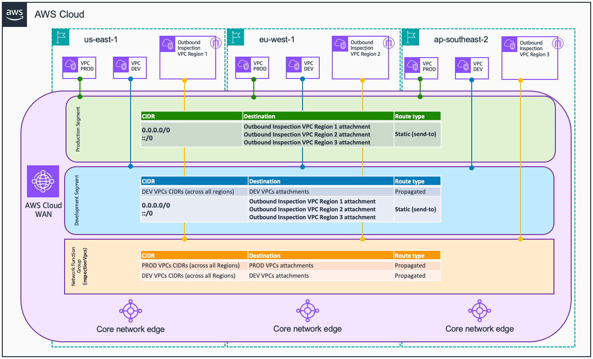
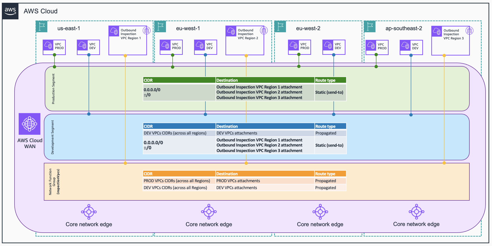
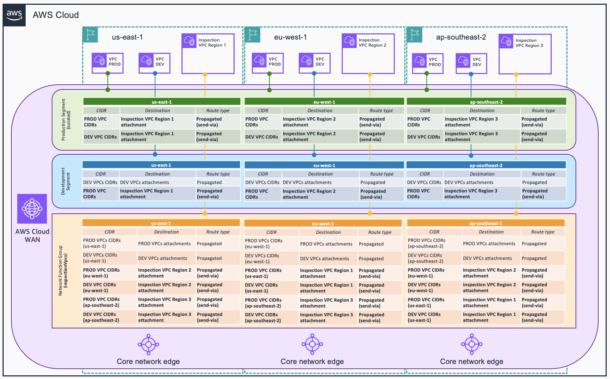
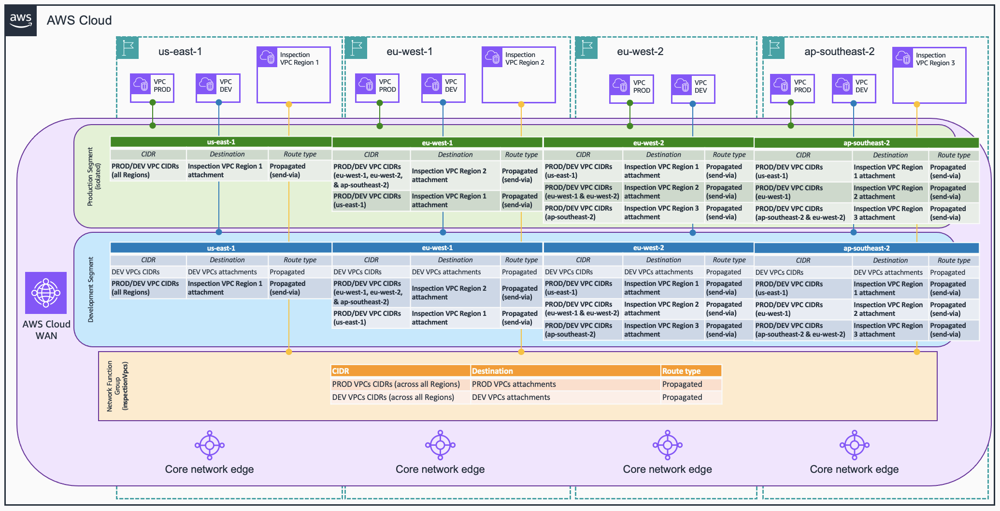
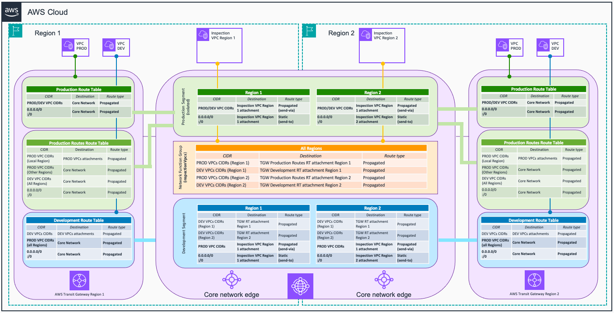

# Traffic Inspection Architectures with AWS Cloud WAN

This repository contains code (in AWS CloudFormation and Terraform) to deploy several inspection architectures using [AWS Cloud WAN](https://aws.amazon.com/cloud-wan/) - with [AWS Network Firewall](https://aws.amazon.com/network-firewall/) as inspection solution. The use cases covered are the following ones:

* Centralized Outbound.
* East/West traffic, with both spoke VPCs and inspection VPCs attached to AWS Cloud WAN.
* East/West traffic, with spoke VPCs attached to a peered [AWS Transit Gateway](https://aws.amazon.com/transit-gateway/) and inspection VPCs attached to AWS Cloud WAN.

Resources are deployed in three AWS Regions: **N. Virginia (us-east-1)**, **Ireland (eu-west-1)**, **Sydney (ap-southeast-2)**, and **London (eu-west-2)** (this last Region only in some examples). For specific information about how to deploy each use case, please check the corresponding use case's folder under the corresponding IaC's framework folder (*cloudformation* or *terraform*) you want to use.

The examples take advantage of Cloud WAN's [service insertion](https://docs.aws.amazon.com/network-manager/latest/cloudwan/cloudwan-policy-service-insertion.html) feature to simplify the configuration of inspection routes (east-west and north-south) between VPCs within the same or different routing domains.

## Use cases

In all use cases, you will find two routing domains: **production** and **development**. The inspection requirements are the following ones:

* VPCs within the **production** segment will be inspected.
* Inter-segment traffic will be inspected.
* VPCs within the **development** segment can talk between each other directly.

This repository does not focus on AWS Network Firewall's policy configuration, therefore the policy rules configured are simple and only used to test connectivity. 

* For egress traffic, only traffic to *.amazon.com* domains is allowed.
* For east-west traffic, any ICMP packets are allowed, alerting those flows that are going between different routing domains (*production* to *development*).

### Centralized Outbound

The Core Network's policy creates the following resources:

* 1 [segment](https://docs.aws.amazon.com/network-manager/latest/cloudwan/cloudwan-policy-segments.html) per routing domain - *production* (isolated) and *development*. Core Network's policy includes an attachment policy rule that maps each spoke VPCs to the corresponding segment if the attachment contains the following tag: *domain={segment_name}*
* 1 [network function group](https://docs.aws.amazon.com/network-manager/latest/cloudwan/cloudwan-policy-network-function-groups.html) (NFG) for the inspection VPCs. Core Network's policy includes an attachment policy rule that associates the inspection VPC to the NFG if the attachment includes the following tag: *inspection=true*.
* **Service Insertion rules**: in each routing domain's segment, a [send-to](https://docs.aws.amazon.com/network-manager/latest/cloudwan/cloudwan-policy-service-insertion.html#:~:text=insertion%2Denabled%20segment.-,Send%20to,-%E2%80%94%20Traffic%20flows%20north) action is created to send the default traffic (0.0.0.0/0 and ::/0) to the inspection VPCs.



```json
{
    "version": "2021.12",
    "core-network-configuration": {
      "vpn-ecmp-support": true,
      "asn-ranges": [
        "64520-65525"
      ],
      "edge-locations": [
        {
          "location": "eu-west-1"
        },
        {
          "location": "us-east-1"
        },
        {
          "location": "ap-southeast-2"
        }
      ]
    },
    "segments": [
      {
        "name": "production",
        "require-attachment-acceptance": false,
        "isolate-attachments": true
      },
      {
        "name": "development",
        "require-attachment-acceptance": false
      }
    ],
    "network-function-groups": [
      {
        "name": "inspectionVpcs",
        "require-attachment-acceptance": false
      }
    ],
    "segment-actions": [
      {
        "action": "send-to",
        "segment": "production",
        "via": {
          "network-function-groups": [
            "inspectionVpcs"
          ]
        }
      },
      {
        "action": "send-to",
        "segment": "development",
        "via": {
          "network-function-groups": [
            "inspectionVpcs"
          ]
        }
      }
    ],
    "attachment-policies": [
      {
        "rule-number": 100,
        "condition-logic": "or",
        "conditions": [
          {
            "type": "tag-value",
            "operator": "equals",
            "key": "inspection",
            "value": "true"
          }
        ],
        "action": {
            "add-to-network-function-group": "inspectionVpcs"
        }
      },
      {
        "rule-number": 200,
        "condition-logic": "or",
        "conditions": [
          {
            "type": "tag-exists",
            "key": "domain"
          }
        ],
        "action": {
          "association-method": "tag",
          "tag-value-of-key": "domain"
        }
      }
    ]
}
```

### Centralized Outbound (AWS Region without Inspection VPC)

This example is similar to the one above, with the difference that we add 1 AWS Region that does not have Inspection VPC. We take advantage of Cloud WAN's service insertion feature to make sure outbound traffic is inspected by the closest Region with Inspection VPC. In this example, London (eu-west-2) does not have Inspection VPC, and we want Ireland (eu-west-1) to  inspect outbound traffic from both Ireland and London.

The Core Network's policy creates the following resources:

* 1 [segment](https://docs.aws.amazon.com/network-manager/latest/cloudwan/cloudwan-policy-segments.html) per routing domain - *production* (isolated) and *development*. Core Network's policy includes an attachment policy rule that maps each spoke VPCs to the corresponding segment if the attachment contains the following tag: *domain={segment_name}*
* 1 [network function group](https://docs.aws.amazon.com/network-manager/latest/cloudwan/cloudwan-policy-network-function-groups.html) (NFG) for the inspection VPCs. Core Network's policy includes an attachment policy rule that associates the inspection VPC to the NFG if the attachment includes the following tag: *inspection=true*.
* **Service Insertion rules**: in each routing domain's segment, a [send-to](https://docs.aws.amazon.com/network-manager/latest/cloudwan/cloudwan-policy-service-insertion.html#:~:text=insertion%2Denabled%20segment.-,Send%20to,-%E2%80%94%20Traffic%20flows%20north) action is created to send the default traffic (0.0.0.0/0 and ::/0) to the inspection VPCs.
  * A *with-edge-overrides* parameter is included to indicate that traffic from *eu-west-2* should be inspected by *eu-west-1* (given *eu-west-2* won't have a local Inspection VPC).



```json
{
  "version": "2021.12",
  "core-network-configuration": {
    "vpn-ecmp-support": true,
    "asn-ranges": [
      "64520-65525"
    ],
    "edge-locations": [
      {
        "location": "eu-west-1"
      },
      {
        "location": "eu-west-2"
      },
      {
        "location": "us-east-1"
      },
      {
        "location": "ap-southeast-2"
      }
    ]
  },
  "segments": [
    {
      "name": "production",
      "require-attachment-acceptance": false,
      "isolate-attachments": true
    },
    {
      "name": "development",
      "require-attachment-acceptance": false
    }
  ],
  "network-function-groups": [
    {
      "name": "inspectionVpcs",
      "require-attachment-acceptance": false
    }
  ],
  "segment-actions": [
    {
      "action": "send-to",
      "segment": "production",
      "via": {
        "network-function-groups": [
          "inspectionVpcs"
        ],
        "with-edge-overrides": [
          {
            "edge-sets": [
              [
                "eu-west-2"
              ]
            ],
            "use-edge-location": "eu-west-1"
          }
        ]
      }
    },
    {
      "action": "send-to",
      "segment": "development",
      "via": {
        "network-function-groups": [
          "inspectionVpcs"
        ],
        "with-edge-overrides": [
          {
            "edge-sets": [
              [
                "eu-west-2"
              ]
            ],
            "use-edge-location": "eu-west-1"
          }
        ]
      }
    }
  ],
  "attachment-policies": [
    {
      "rule-number": 100,
      "condition-logic": "or",
      "conditions": [
        {
          "type": "tag-value",
          "operator": "equals",
          "key": "inspection",
          "value": "true"
        }
      ],
      "action": {
        "add-to-network-function-group": "inspectionVpcs"
      }
    },
    {
      "rule-number": 200,
      "condition-logic": "or",
      "conditions": [
        {
          "type": "tag-exists",
          "key": "domain"
        }
      ],
      "action": {
        "association-method": "tag",
        "tag-value-of-key": "domain"
      }
    }
  ]
}
```

### East/West traffic (Dual-hop inspection)

The Core Network's policy creates the following resources:

* 1 [segment](https://docs.aws.amazon.com/network-manager/latest/cloudwan/cloudwan-policy-segments.html) per routing domain - *production* (isolated) and *development*. Core Network's policy includes an attachment policy rule that maps each spoke VPCs to the corresponding segment if the attachment contains the following tag: *domain={segment_name}*
* 1 [network function group](https://docs.aws.amazon.com/network-manager/latest/cloudwan/cloudwan-policy-network-function-groups.html) (NFG) for the inspection VPCs. Core Network's policy includes an attachment policy rule that associates the inspection VPC to the NFG if the attachment includes the following tag: *inspection=true*.
* **Service Insertion rules**: one [send-via](https://docs.aws.amazon.com/network-manager/latest/cloudwan/cloudwan-policy-service-insertion.html#:~:text=north%2Dsouth%20traffic.-,Send%20via,-%E2%80%94%20Traffic%20flows%20east) action to inspect the traffic between VPCs in the *production* segment, and between the *production* and *development* segments. The mode used is *dual-hop*, meaning that traffic traversing two AWS Regions is inspected in both of them.


  
```json
{
    "version": "2021.12",
    "core-network-configuration": {
      "vpn-ecmp-support": true,
      "asn-ranges": [
        "64520-65525"
      ],
      "edge-locations": [
        {
          "location": "eu-west-1"
        },
        {
          "location": "us-east-1"
        },
        {
          "location": "ap-southeast-2"
        }
      ]
    },
    "segments": [
      {
        "name": "production",
        "require-attachment-acceptance": false,
        "isolate-attachments": true
      },
      {
        "name": "development",
        "require-attachment-acceptance": false
      }
    ],
    "network-function-groups": [
      {
        "name": "inspectionVpcs",
        "require-attachment-acceptance": false
      }
    ],
    "segment-actions": [
      {
        "action": "send-via",
        "segment": "production",
        "mode": "dual-hop",
        "when-sent-to": {
          "segments": "*"
        },
        "via": {
          "network-function-groups": [
            "inspectionVpcs"
          ]
        }
      }
    ],
    "attachment-policies": [
      {
        "rule-number": 100,
        "condition-logic": "or",
        "conditions": [
          {
            "type": "tag-value",
            "operator": "equals",
            "key": "inspection",
            "value": "true"
          }
        ],
        "action": {
            "add-to-network-function-group": "inspectionVpcs"
        }
      },
      {
        "rule-number": 200,
        "condition-logic": "or",
        "conditions": [
          {
            "type": "tag-exists",
            "key": "domain"
          }
        ],
        "action": {
          "association-method": "tag",
          "tag-value-of-key": "domain"
        }
      }
    ]
}
```

### East/West traffic (Single-hop inspection)

The Core Network's policy creates the following resources:

* 1 [segment](https://docs.aws.amazon.com/network-manager/latest/cloudwan/cloudwan-policy-segments.html) per routing domain - *production* (isolated) and *development*. Core Network's policy includes an attachment policy rule that maps each spoke VPCs to the corresponding segment if the attachment contains the following tag: *domain={segment_name}*
* 1 [network function group](https://docs.aws.amazon.com/network-manager/latest/cloudwan/cloudwan-policy-network-function-groups.html) (NFG) for the inspection VPCs. Core Network's policy includes an attachment policy rule that associates the inspection VPC to the NFG if the attachment includes the following tag: *inspection=true*.
* **Service Insertion rules**: one [send-via](https://docs.aws.amazon.com/network-manager/latest/cloudwan/cloudwan-policy-service-insertion.html#:~:text=north%2Dsouth%20traffic.-,Send%20via,-%E2%80%94%20Traffic%20flows%20east) action to inspect the traffic between VPCs in the *production* segment, and between the *production* and *development* segments. 
  * The mode used is *single-hop*, meaning that traffic traversing two AWS Regions is inspected in only one of them.
  * In addition, one of the Regions (*eu-west-2* in the example) does not have local Inspection VPC. With *single-hop* mode, the traffic from this Region to other ones is inspected in the Region with a local Inspection VPC. For inspection between segments within the Region, *eu-west-1* is used.

The following matrix is used to determine which Inspection VPC is used for traffic inspection:

| *AWS Region*       | us-east-1 | eu-west-1 | eu-west-2      | ap-south-east-2 |
| --------------     |:---------:| ---------:| --------------:| ---------------:|
| **us-east-1**      | us-east-1 | us-east-1 | us-east-1      | us-east-1       |
| **eu-west-1**      | us-east-1 | eu-west-1 | eu-west-1      | eu-west-1       | 
| **eu-west-2**      | us-east-1 | eu-west-1 | eu-west-1      | ap-southeast-2  |
| **ap-southeast-2** | us-east-1 | eu-west-1 | ap-southeast-2 | ap-southeast-2  |



```json
{
    "version": "2021.12",
    "core-network-configuration": {
      "vpn-ecmp-support": true,
      "asn-ranges": [
        "64520-65525"
      ],
      "edge-locations": [
        {
          "location": "eu-west-1"
        },
        {
          "location": "eu-west-2"
        },
        {
          "location": "us-east-1"
        },
        {
          "location": "ap-southeast-2"
        }
      ]
    },
    "segments": [
      {
        "name": "production",
        "require-attachment-acceptance": false,
        "isolate-attachments": true
      },
      {
        "name": "development",
        "require-attachment-acceptance": false
      }
    ],
    "network-function-groups": [
      {
        "name": "inspectionVpcs",
        "require-attachment-acceptance": false
      }
    ],
    "segment-actions": [
      {
        "action": "send-via",
        "segment": "production",
        "mode": "single-hop",
        "when-sent-to": {
          "segments": "*"
        },
        "via": {
          "network-function-groups": [
            "inspectionVpcs"
          ],
          "with-edge-overrides": [
            {
              "edge-sets": [
                [
                  "us-east-1",
                  "eu-west-1"
                ]
              ],
              "use-edge-location": "us-east-1"
            },
            {
              "edge-sets": [
                [
                  "us-east-1",
                  "ap-southeast-2"
                ]
              ],
              "use-edge-location": "us-east-1"
            },
            {
              "edge-sets": [
                [
                  "ap-southeast-2",
                  "eu-west-1"
                ]
              ],
              "use-edge-location": "eu-west-1"
            },
            {
              "edge-sets": [
                [
                  "eu-west-2",
                  "eu-west-1"
                ]
              ],
              "use-edge-location": "eu-west-1"
            },
            {
              "edge-sets": [
                [
                  "eu-west-2",
                  "us-east-1"
                ]
              ],
              "use-edge-location": "us-east-1"
            },
            {
              "edge-sets": [
                [
                  "ap-southeast-2",
                  "eu-west-2"
                ]
              ],
              "use-edge-location": "ap-southeast-2"
            },
            {
              "edge-sets": [
                [
                  "eu-west-2"
                ]
              ],
              "use-edge-location": "eu-west-1"
            }
          ]
        }
      }
    ],
    "attachment-policies": [
      {
        "rule-number": 100,
        "condition-logic": "or",
        "conditions": [
          {
            "type": "tag-value",
            "operator": "equals",
            "key": "inspection",
            "value": "true"
          }
        ],
        "action": {
            "add-to-network-function-group": "inspectionVpcs"
        }
      },
      {
        "rule-number": 200,
        "condition-logic": "or",
        "conditions": [
          {
            "type": "tag-exists",
            "key": "domain"
          }
        ],
        "action": {
          "association-method": "tag",
          "tag-value-of-key": "domain"
        }
      }
    ]
}
```

### East/West traffic, with Spoke VPCs attached to a peered AWS Transit Gateway and Inspection VPCs attached to AWS Cloud WAN.

The following resources are created:

* In each AWS Region, the spoke VPCs are attached to a Transit Gateway. Three TGW route tables are created:
  * The spoke VPCs of the production routing domain are associated to the **production* route table.
  * The spoke VPCs of the development routing domain are associated and propagate their routes to the *development* route table.
  * A third route table (*prod_routes*) is created to inject the production spoke VPCs to Cloud WAN. This enables Cloud WAN to learn the production VPCs CIDRs to create the corresponding routes when configuring the Service Insertion actions.
  * Each Transit Gateway is peered with Cloud WAN.
* The Cloud WAN policy configures the following:
  * 1 [segment](https://docs.aws.amazon.com/network-manager/latest/cloudwan/cloudwan-policy-segments.html) per routing domain - *production* (isolated) and *development*. Core Network's policy includes an attachment policy rule that associates each Transit Gateway route table attachment to the corresponding segment if the attachment contains the following tag: *domain={segment_name}*. In the example, the *production* and *prod_routes* TGW route table are associated to the *production* segment, and the *development* route table is associated to the *development* segment.
  * 1 [network function group](https://docs.aws.amazon.com/network-manager/latest/cloudwan/cloudwan-policy-network-function-groups.html) (NFG) for the inspection VPCs. Core Network's policy includes an attachment policy rule that associates the inspection VPC to the NFG if the attachment includes the following tag: *inspection=true*.
  * **Service Insertion rules**: 
    * One [send-via](https://docs.aws.amazon.com/network-manager/latest/cloudwan/cloudwan-policy-service-insertion.html#:~:text=north%2Dsouth%20traffic.-,Send%20via,-%E2%80%94%20Traffic%20flows%20east) action to inspect the traffic between VPCs in the *production* segment, and between the *production* and *development* segments.
    * With only the send-via action, you will see in the TGWs a path to connect VPCs within the same routing domain (*production* via inspection, *development* direct path) and within different routing domains in different Regions (via inspection). However, routes between segments in the same Region (via inspection) won't be propagated.
    * To allow communication between routing domains in the same Region, two [send-to](https://docs.aws.amazon.com/network-manager/latest/cloudwan/cloudwan-policy-service-insertion.html#:~:text=insertion%2Denabled%20segment.-,Send%20to,-%E2%80%94%20Traffic%20flows%20north) actions are created to send the default traffic (0.0.0.0/0 and ::/0) to the inspection VPCs.

Given we need to create a send-to action via the NFG, the east-west traffic inspection (send-via) between Regions can only be done using *single-hop* configuration. This is because a NFG can only be used in one mode (either *single-hop* or *dual-hop*), but not both at the same time.



```json
{
  "version": "2021.12",
  "core-network-configuration": {
    "vpn-ecmp-support": true,
    "asn-ranges": [
      "64520-65525"
    ],
    "edge-locations": [
      {
        "location": "eu-west-1"
      },
      {
        "location": "us-east-1"
      },
      {
        "location": "ap-southeast-2"
      }
    ]
  },
  "segments": [
    {
      "name": "production",
      "require-attachment-acceptance": false,
      "isolate-attachments": true
    },
    {
      "name": "development",
      "require-attachment-acceptance": false
    }
  ],
  "network-function-groups": [
    {
      "name": "inspectionVpcs",
      "require-attachment-acceptance": false
    }
  ],
  "segment-actions": [
    {
      "action": "send-to",
      "segment": "production",
      "via": {
        "network-function-groups": [
          "inspectionVpcs"
        ]
      }
    },
    {
      "action": "send-to",
      "segment": "development",
      "via": {
        "network-function-groups": [
          "inspectionVpcs"
        ]
      }
    },
    {
      "action": "send-via",
      "segment": "production",
      "mode": "single-hop",
      "when-sent-to": {
        "segments": "*"
      },
      "via": {
        "network-function-groups": [
          "inspectionVpcs"
        ],
        "with-edge-overrides": [
          {
            "edge-sets": [
              [
                "us-east-1",
                "eu-west-1"
              ]
            ],
            "use-edge-location": "us-east-1"
          },
          {
            "edge-sets": [
              [
                "us-east-1",
                "ap-southeast-2"
              ]
            ],
            "use-edge-location": "us-east-1"
          },
          {
            "edge-sets": [
              [
                "ap-southeast-2",
                "eu-west-1"
              ]
            ],
            "use-edge-location": "eu-west-1"
          }
        ]
      }
    }
  ],
  "attachment-policies": [
    {
      "rule-number": 100,
      "condition-logic": "or",
      "conditions": [
        {
          "type": "tag-value",
          "operator": "equals",
          "key": "inspection",
          "value": "true"
        }
      ],
      "action": {
        "add-to-network-function-group": "inspectionVpcs"
      }
    },
    {
      "rule-number": 200,
      "condition-logic": "or",
      "conditions": [
        {
          "type": "tag-exists",
          "key": "domain"
        }
      ],
      "action": {
        "association-method": "tag",
        "tag-value-of-key": "domain"
      }
    }
  ]
}
```

## Security

See [CONTRIBUTING](CONTRIBUTING.md#security-issue-notifications) for more information.

## License

This library is licensed under the MIT-0 License. See the LICENSE file.

