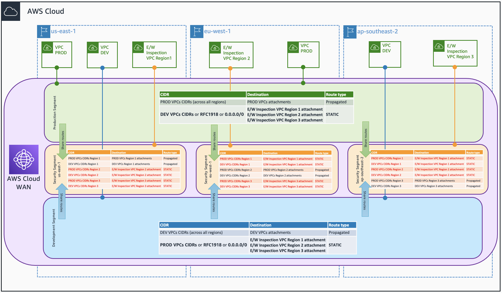
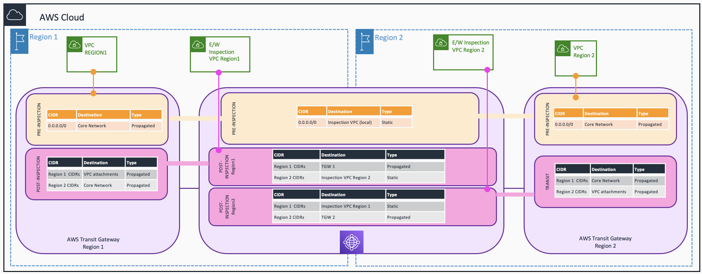

# Traffic Inspection Architectures with AWS Cloud WAN

This repository contains code (in AWS CloudFormation and Terraform) to deploy several inspection architectures using AWS Cloud WAN - with AWS Network Firewall as inspection solution. The use cases covered are the following ones:

* Centralized Outbound.
* East/West traffic, with both Spoke VPCs and Inspection VPCs attached to AWS Cloud WAN.
* East/West traffic, with both Spoke VPCs and Inspection VPCs attached to AWS Transit Gateway and peered with AWS Cloud WAN.
* East/West traffic, with Spoke VPCs attached to a peered AWS Transit Gateway and Inspection VPCs attached to AWS Cloud WAN.

In all the examples we are deploying resources in three AWS Regions: N. Virginia (us-east-1), Ireland (eu-west-1), and Sydney (ap-southeast-2)

## Use cases

### Centralized Outbound

* 1 segment per routing domain, plus 1 segment for the post-inspection (*security* in the example)
* Spoke VPCs are attached to the corresponding segment, and the Inspection VPCs to the *security* segment.
* In each routing domain's segment, there's a static route (0.0.0.0/0) pointing to the Inspection VPC attachments. Traffic will be routed to the local Inspection VPC attachment.
* Routing domain's segments share their routes with the *security* segment, so the return traffic can reach the proper VPC.


```json
{
  "version": "2021.12",
  "core-network-configuration": {
    "asn-ranges": [
      "64520-65525"
    ],
    "edge-locations": [
      { "location": "eu-west-1" },
      { "location": "us-east-1" },
      { "location": "ap-southeast-2" }
    ],
    "vpn-ecmp-support": false
  },
   "segments": [
    {
      "name": "dev",
      "isolate-attachments": false,
      "require-attachment-acceptance": false
    },
    {
      "name": "prod",
      "isolate-attachments": false,
      "require-attachment-acceptance": false
    },
    {
      "name": "security",
      "isolate-attachments": false,
      "require-attachment-acceptance": false
    }
  ],
  "attachment-policies": [
    {
      "action": {
        "association-method": "tag",
        "tag-value-of-key": "domain"
      },
      "condition-logic": "or",
      "conditions": [
        {
          "key": "domain",
          "type": "tag-exists"
        }
      ],
      "rule-number": 100
    }
  ],
  "segment-actions": [
    {
      "action": "share",
      "mode": "attachment-route",
      "segment": "dev",
      "share-with": [
        "security"
      ]
    },
    {
      "action": "share",
      "mode": "attachment-route",
      "segment": "prod",
      "share-with": [
        "security"
      ]
    },
    {
      "action": "create-route",
      "destination-cidr-blocks": [
        "0.0.0.0/0"
      ],
      "destinations": [
        "attachment-XXX",
        "attachment-YYY",
        "attachment-ZZZ"
      ],
      "segment": "dev"
    },
    {
      "action": "create-route",
      "destination-cidr-blocks": [
        "0.0.0.0/0"
      ],
      "destinations": [
        "attachment-XXX",
        "attachment-YYY",
        "attachment-ZZZ"
      ],
      "segment": "prod"
    }
  ]
}
```

### East/West traffic, with both Spoke VPCs and Inspection VPCs attached to AWS Cloud WAN.

* 1 segment per routing domain, plus 1 segment for the post-inspection per AWS Region.
  * In the example we are creating resources in 3 AWS Regions, so 3 *security* segments are needed.
  * Each Inspection VPC will be attached to a dedicated *security* segment, although all segments need to be created in all the AWS Regions (so they can reach all the Spoke VPCs).
* In each routing domain's segment, there's a static route (0.0.0.0/0) pointing to the Inspection VPC attachments. 
  * Traffic will be routed to the local Inspection VPC attachment.
  * VPCs within the same segment can talk between each other by default. If you want inter-routing domain traffic inspection, create an isolated segment.
* Static routes are created in each AWS Region *security* segment. 
  * These static routes point to the other AWS Region Inspection VPC attachments when the traffic is destined to the Spoke VPCs of that specific AWS Region.
  * Inter-region traffic needs to be inspected twice (in both Inspection VPCs) to avoid asymmetric traffic.
* Routing domain's segments share their routes with the *security* segment, so the return traffic can reach the proper VPC - when doing intra-Region inspection.


  
```json
{
  "version": "2021.12",
  "core-network-configuration": {
    "asn-ranges": [
      "64520-65525"
    ],
    "edge-locations": [
      { "location": "eu-west-1" },
      { "location": "us-east-1" },
      { "location": "ap-southeast-2" }
    ],
    "vpn-ecmp-support": false
  },
  "segments": [
    {
      "name": "prod",
      "isolate-attachments": false,
      "require-attachment-acceptance": false
    },
    {
      "name": "dev",
      "isolate-attachments": false,
      "require-attachment-acceptance": false
    },
    {
      "name": "inspectionireland",
      "isolate-attachments": false,
      "require-attachment-acceptance": false
    },
    {
      "name": "inspectionnvirginia",
      "isolate-attachments": false,
      "require-attachment-acceptance": false
    },
    {
      "name": "inspectionsydney",
      "isolate-attachments": false,
      "require-attachment-acceptance": false
    }
  ],
  "attachment-policies": [
    {
      "action": {
        "association-method": "tag",
        "tag-value-of-key": "domain"
      },
      "condition-logic": "or",
      "conditions": [
        {
          "key": "domain",
          "type": "tag-exists"
        }
      ],
      "rule-number": 100
    }
  ],
  "segment-actions": [
    {
      "action": "share",
      "mode": "attachment-route",
      "segment": "dev",
      "share-with": [
        "inspectionsydney",
        "inspectionnvirginia",
        "inspectionireland"
      ]
    },
    {
      "action": "share",
      "mode": "attachment-route",
      "segment": "prod",
      "share-with": [
        "inspectionsydney",
        "inspectionnvirginia",
        "inspectionireland"
      ]
    },
    {
      "action": "create-route",
      "destination-cidr-blocks": [
        "0.0.0.0/0"
      ],
      "destinations": [
        "attachment-XXX",
        "attachment-YYY",
        "attachment-ZZZ"
      ],
      "segment": "dev"
    },
    {
      "action": "create-route",
      "destination-cidr-blocks": [
        "0.0.0.0/0"
      ],
      "destinations": [
        "attachment-XXX",
        "attachment-YYY",
        "attachment-ZZZ"
      ],
      "segment": "prod"
    },
    {
      "action": "create-route",
      "destination-cidr-blocks": [
        "10.10.1.0/24",
        "10.10.0.0/24"
      ],
      "destinations": [
        "attachment-YYY"
      ],
      "segment": "inspectionireland"
    },
    {
      "action": "create-route",
      "destination-cidr-blocks": [
        "10.20.1.0/24",
        "10.20.0.0/24"
      ],
      "destinations": [
        "attachment-XXX"
      ],
      "segment": "inspectionireland"
    },
    {
      "action": "create-route",
      "destination-cidr-blocks": [
        "10.0.1.0/24",
        "10.0.0.0/24"
      ],
      "destinations": [
        "attachment-ZZZ"
      ],
      "segment": "inspectionnvirginia"
    },
    {
      "action": "create-route",
      "destination-cidr-blocks": [
        "10.20.1.0/24",
        "10.20.0.0/24"
      ],
      "destinations": [
        "attachment-XXX"
      ],
      "segment": "inspectionnvirginia"
    },
    {
      "action": "create-route",
      "destination-cidr-blocks": [
        "10.0.1.0/24",
        "10.0.0.0/24"
      ],
      "destinations": [
        "attachment-ZZZ"
      ],
      "segment": "inspectionsydney"
    },
    {
      "action": "create-route",
      "destination-cidr-blocks": [
        "10.10.1.0/24",
        "10.10.0.0/24"
      ],
      "destinations": [
        "attachment-YYY"
      ],
      "segment": "inspectionsydney"
    }
  ]
}
```

### East/West traffic, with both Spoke VPCs and Inspection VPCs attached to AWS Transit Gateway and peered with AWS Cloud WAN.

* Spoke VPCs and Inspection VPC in each AWS Region are attached to the Transit Gateway.
  * Spoke VPC attachments are associated with a *pre-inspection* route table with a static route (0.0.0.0/0) pointing to the Inspection VPC.
  * Inspection VPC attachment is associated with a *post-inspection* route table.
  * A third route table (*cross-region*) contains a static route with destination the Spoke VPC CIDR blocks pointing to the Inspection VPC. This route(s) will be used to enforce the inspection of traffic coming from another AWS Region.
  * Spoke VPCs propagate to the *post-inspection* route table.
* In the Core Network, per AWS Region there are two segments: *post-inspection* and *cross-region*. Two Transit Gateway Route Table attachments are created per AWS Region, connecting the corresponding route tables and segments.
  * The *cross-region* segment will get propagated the static route from the *cross-region* route table (access to the Inspection VPC of that AWS Region). Each *cross-region* segment will share this route with the *post-inspection* segments in the other AWS Regions.
  * The *post-inspection* segment will propagate this route shared by the *cross-region* segment to the *post-inspection* route table. That way, when traffic needs to traverse two AWS Regions, it will be inspected in both AWS Regions - and asymmetric traffic will be avoided.


```json
{
  "version": "2021.12",
  "core-network-configuration": {
    "asn-ranges": [
      "64520-65525"
    ],
    "edge-locations": [
      { "location": "eu-west-1" },
      { "location": "us-east-1" },
      { "location": "ap-southeast-2" }
    ],
    "vpn-ecmp-support": false
  },
  "segments": [
    {
      "name": "postinspectionireland",
      "isolate-attachments": false,
      "require-attachment-acceptance": false
    },
    {
      "name": "postinspectionnvirginia",
      "isolate-attachments": false,
      "require-attachment-acceptance": false
    },
    {
      "name": "postinspectionsydney",
      "isolate-attachments": false,
      "require-attachment-acceptance": false
    },
    {
      "name": "crossregionireland",
      "isolate-attachments": false,
      "require-attachment-acceptance": false
    },
    {
      "name": "crossregionnvirginia",
      "isolate-attachments": false,
      "require-attachment-acceptance": false
    },
    {
      "name": "crossregionsydney",
      "isolate-attachments": false,
      "require-attachment-acceptance": false
    }
  ],
  "attachment-policies": [
    {
      "action": {
        "association-method": "tag",
        "tag-value-of-key": "domain"
      },
      "condition-logic": "or",
      "conditions": [
        {
          "key": "domain",
          "type": "tag-exists"
        }
      ],
      "rule-number": 100
    }
  ],
  "segment-actions": [
    {
      "action": "share",
      "mode": "attachment-route",
      "segment": "crossregionireland",
      "share-with": [
        "postinspectionsydney",
        "postinspectionnvirginia"
      ]
    },
    {
      "action": "share",
      "mode": "attachment-route",
      "segment": "crossregionnvirginia",
      "share-with": [
        "postinspectionsydney",
        "postinspectionireland"
      ]
    },
    {
      "action": "share",
      "mode": "attachment-route",
      "segment": "crossregionsydney",
      "share-with": [
        "postinspectionnvirginia",
        "postinspectionireland"
      ]
    }
  ]
}
```

### East/West traffic, with Spoke VPCs attached to a peered AWS Transit Gateway and Inspection VPCs attached to AWS Cloud WAN.

* Spoke VPCs in each AWS Region are attached to the Transit Gateway.
  * The VPC attachments are associated with a *pre-inspection* route table, which gets propagated the route to the local Inspection VPC via the peering with the Core Network.
  * The VPC attachments propagate their routes to a *post-inspection* route table, propagating these routes to the Core Network via the peering.
* The Inspection VPCs are attached to the Core Network.
* In the Core Network there are two type of segments:
  * One *pre-inspection* segment with a static route (0.0.0.0/0) to the Inspection VPCs.
  * One *post-inspection* segment per AWS Region, where each Inspection VPC attachment will be associated. In each segment, the local Spoke VPC CIDRs will be propagated from the peering with the Transit Gateway.
  * In each *post-inspection* segment, a static route to the other AWS Region CIDRs (pointing to that AWS Region Inspection VPC) is created. That way, inter-Region traffic is inspected in both AWS Regions - avoiding asymmetric traffic.



```json
{
  "version": "2021.12",
  "core-network-configuration": {
    "asn-ranges": [
      "64520-65525"
    ],
    "edge-locations": [
      { "location": "eu-west-1" },
      { "location": "us-east-1" },
      { "location": "ap-southeast-2" }
    ],
    "vpn-ecmp-support": false
  },
  "segments": [
    {
      "name": "preinspection",
      "isolate-attachments": false,
      "require-attachment-acceptance": false
    },
    {
      "name": "postinspectionireland",
      "isolate-attachments": false,
      "require-attachment-acceptance": false
    },
    {
      "name": "postinspectionnvirginia",
      "isolate-attachments": false,
      "require-attachment-acceptance": false
    },
    {
      "name": "postinspectionsydney",
      "isolate-attachments": false,
      "require-attachment-acceptance": false
    }
  ],
  "attachment-policies": [
    {
      "action": {
        "association-method": "tag",
        "tag-value-of-key": "domain"
      },
      "condition-logic": "or",
      "conditions": [
        {
          "key": "domain",
          "type": "tag-exists"
        }
      ],
      "rule-number": 100
    }
  ],
  "segment-actions": [
    {
      "action": "create-route",
      "destination-cidr-blocks": [
        "0.0.0.0/0"
      ],
      "destinations": [
        "attachment-XXX",
        "attachment-YYY",
        "attachment-ZZZ"
      ],
      "segment": "preinspection"
    },
    {
      "action": "create-route",
      "destination-cidr-blocks": [
        "10.10.1.0/24",
        "10.10.0.0/24"
      ],
      "destinations": [
        "attachment-XXX"
      ],
      "segment": "postinspectionireland"
    },
    {
      "action": "create-route",
      "destination-cidr-blocks": [
        "10.20.1.0/24",
        "10.20.0.0/24"
      ],
      "destinations": [
        "attachment-YYY"
      ],
      "segment": "postinspectionireland"
    },
    {
      "action": "create-route",
      "destination-cidr-blocks": [
        "10.0.1.0/24",
        "10.0.0.0/24"
      ],
      "destinations": [
        "attachment-ZZZ"
      ],
      "segment": "postinspectionnvirginia"
    },
    {
      "action": "create-route",
      "destination-cidr-blocks": [
        "10.20.1.0/24",
        "10.20.0.0/24"
      ],
      "destinations": [
        "attachment-YYY"
      ],
      "segment": "postinspectionnvirginia"
    },
    {
      "action": "create-route",
      "destination-cidr-blocks": [
        "10.0.1.0/24",
        "10.0.0.0/24"
      ],
      "destinations": [
        "attachment-ZZZ"
      ],
      "segment": "postinspectionsydney"
    },
    {
      "action": "create-route",
      "destination-cidr-blocks": [
        "10.10.1.0/24",
        "10.10.0.0/24"
      ],
      "destinations": [
        "attachment-XXX"
      ],
      "segment": "postinspectionsydney"
    }
  ]
}
```

## Security

See [CONTRIBUTING](CONTRIBUTING.md#security-issue-notifications) for more information.

## License

This library is licensed under the MIT-0 License. See the LICENSE file.

