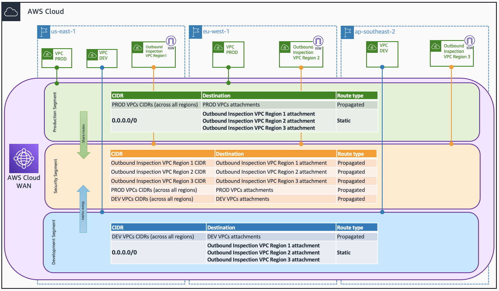

# Centralized Outbound inspection with AWS Cloud WAN

## Prerequisites
- An AWS account with an IAM user with the appropriate permissions
- Terraform installed

## Code Principles:
- Writing DRY (Do No Repeat Yourself) code using a modular design pattern

## Usage
- Clone the repository
- (Optional) Edit the variables.tf file in the project root directory - if you want to test with different parameters.
- Deploy first the Global Network, Core Network, and Policy document attachment by using `terraform apply -target="aws_networkmanager_global_network.global_network" -target="aws_networkmanager_core_network.core_network" -target="aws_networkmanager_core_network_policy_attachment.core_network_policy_attachment"`
- Deploy the resources using `terraform apply`.
- Uncomment lines 88 - 98 in *cloud_wan_poliy.tf* file to create the static routes in the Core Network.
- Deploy the updated policy using `terraform apply`.
- Remember to clean up resoures once you are done by using `terraform destroy`.

**Note** EC2 instances, VPC endpoints, and AWS Network Firewall endpoints will be deployed in all the Availability Zones configured for each VPC. Keep this in mind when testing this environment from a cost perspective - for production environments, we recommend the use of at least 2 AZs for high-availability.